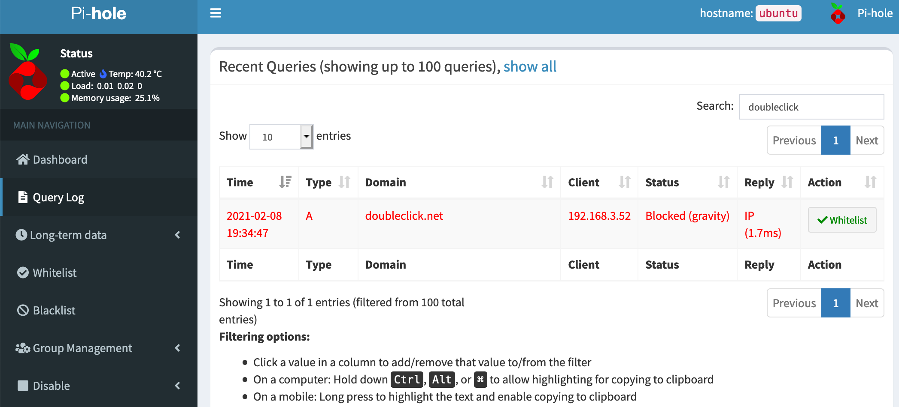

# Pi DNS
Set up your Raspberry Pi as an ad blocking DNS server, using Pi-Hole and Cloudflare DNS-over-HTTPS 🚀

## Executive summary

This repo contains semi-manual steps for setting up a [Raspberry Pi](https://www.raspberrypi.org/) using [Pi-Hole](https://pi-hole.net/) on your home network to block ads.

We'll use [Cloudflare DNS-over-HTTPS](https://developers.cloudflare.com/1.1.1.1/dns-over-https/cloudflared-proxy) for outgoing DNS requests, and transparently redirect all DNS requests to the Pi-Hole no matter which DNS server was requested.

This:

Becomes this:

🥂🍾

### Contents

- [`raspberry/`](raspberry/) - general Raspberry Pi setup & tools
- [`ufw/`](ufw/) - ressources for enabling the [`ufw`](https://help.ubuntu.com/community/UFW) firewall
- [`cloudflared/`](cloudflared/) -  scripts for downloading and installing the [Cloudflare Argo Tunnel client](https://github.com/cloudflare/cloudflared), and using this to proxy DNS on port 54
- [`unifi/`](unifi/) - router and firewall setup. The specifics are for a [Unifi Security Gateway Pro 4](https://www.ui.com/unifi-routing/unifi-security-gateway-pro-4/), but the rules and settings themselves are general and can be applied on any capable router/firewall combo..

## F.A.Q.

- Q: Why not one big setup script? Why not use Ansible, Terraform or Puppet, or ... ?
- A: Too much hassle😃 I like setting up stuff like this, and I'll likely change something next time I need to do it anyway.

## Acknowledgements

- [@scotthelme](https://github.com/scotthelme): [DNS over HTTPS](https://scotthelme.co.uk/securing-dns-across-all-of-my-devices-with-pihole-dns-over-https-1-1-1-1/)
- [@scotthelme](https://github.com/scotthelme): [Catching naughty devices](https://scotthelme.co.uk/catching-naughty-devices-on-my-home-network/)
- [u/floofcatfuzz](https://www.reddit.com/user/floofcatfuzz/): [Unifi + PiHole, doing it right with USG](https://www.reddit.com/r/Ubiquiti/comments/ii3lan/unifi_pihole_doing_it_right_with_usg/)
